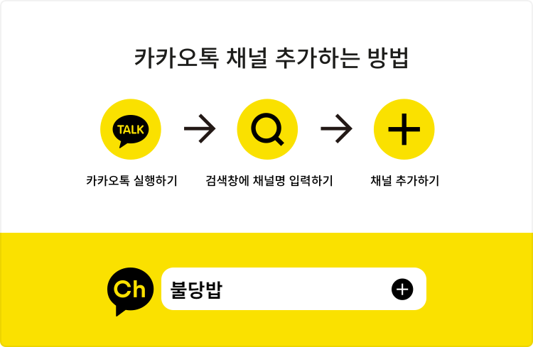

<div align="center">
  
  
  
  [천안불당고등학교 플러스친구](http://pf.kakao.com/_hxgXrC)

  [](https://github.com/standard/standard)
  
</div>

# BULDANG-BAB-KAKAO-i
💬 천안불당고등학교 카카오 i 오픈빌더 챗봇

## 소개
천안불당고등학교의 다양한 정보를 제공하는 카카오톡 챗봇입니다.

- 주요 기능
  - 🍚 오늘, 내일 급식 조회
  - 📘 학급 시간표 조회
  - 📅 이번 달 학사일정 조회
  - ⛅ 불당동 날씨 예보 확인
  

## 개발환경
- Visual Studio Code
```
npm install
node main.js
```
카카오 플러스친구 ID : <b>불당밥</b>  
카카오 플러스친구 프로필 [바로가기](http://pf.kakao.com/_hxgXrC)

## 정보
- 천안불당고등학교의 정보를 쉽게 확인할 수 있도록 도와주는 서비스입니다.
- 서버: Node.js + MariaDB
- 개발자: 정찬옥(참고 및 도와주신분: leegeunhyeok)
- 문의사항: chanok9417@kakao.com
